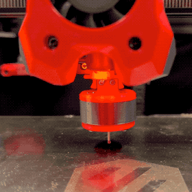
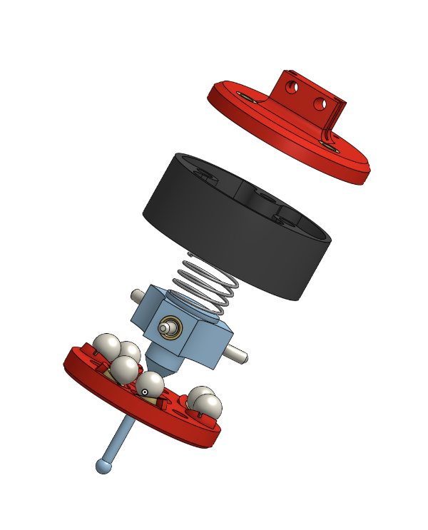

# RenshyProbe
A touch probe based on the [Klicky](https://github.com/jlas1/Klicky-Probe) dock system.

**DO NOT MAKE ONE OF THESE** - It's not ready for prime time.  It doesn't work right.  It may never work right.  I am posting this here just to solicit ideas and comments.

# Bill of Materials

- Printed Parts
- M3 threaded inserts
- 5.5mm steel ball bearings
- Probe tip (https://www.aliexpress.us/item/3256802864707715.html)
- M2.5 threaded insert (for probe tip)
- Spring (still figuring out which is best)
- Pins M3x10.3 (https://www.aliexpress.us/item/2255800449635546.html)
- M3 screws to hold it together
- Klicky Probe parts, magnets and screws
- A bit of 22AWG solid wire (stripped)

# Building it

- Print the parts
- Cut some wire
- Sink the M3 inserts into the 6 places that serve as the seat for the ball bearings. Insert a bit of the 22AWG wire between the insert and the printed plastic part before you press in the insert.  When you're done you should have a circuit with breaks where the balls go, and two leads that lead up to the Klicky dock mount.  Note these go in at an angle.
- For the hub, press in the inserts and thread in the pins.  Press in a 2.5mm heat set insert and install the probe.
- Place the balls carefully in their seats.
- Try to close it all up with the spring in place, and the wires leading up and out
- Feel the anger as the balls go everywhere and you fail to do it.
- Try again, and eventually get it together.
- Find that it doesn't yet work.

# What works

- it does dock and undock
- it does trigger (sometimes) in the Z-axis

# What's wrong with it?

- I've found that it triggers on movement.  Maybe need a stiffer spring?
- I've found that it doesn't reliably trigger
- While I have gotten a 5-probe cycle to successfully return a valid result, very often it does not due to "Probe samples exceed tolerance"-- possibly related to the above too issues
- It might need too much lateral force to trigger before pushing off the Klicky magnetic mount.
- The circuit seems high resistance even when closed.  (on the order of 100Ω or so)
- The balls fall out and rattle around inside if you're too rough with it.  Its hard to get them back in place without disassembling it.

# What needs to be done?

- Make it more reliable
- Some Klipper code that allows probing in the X and Y axes, not just the Z-axis.
- Some more code to make it useful for things.
- Experiment with different geometries for the ball seats.  
- Different sized balls
- Different springs

# Why did I want one?

- I've always wanted a 5-way touch probe. 
- It could be used for making point clouds of things (scanning objects)
- It could be used for calibrating the printer automatically (measuring a single perimeter thickness and determining the extrusion multiplier)
- It could be used to find its own nozzle offset by measuring a 3D printed structure that is in a known location on the bed.
